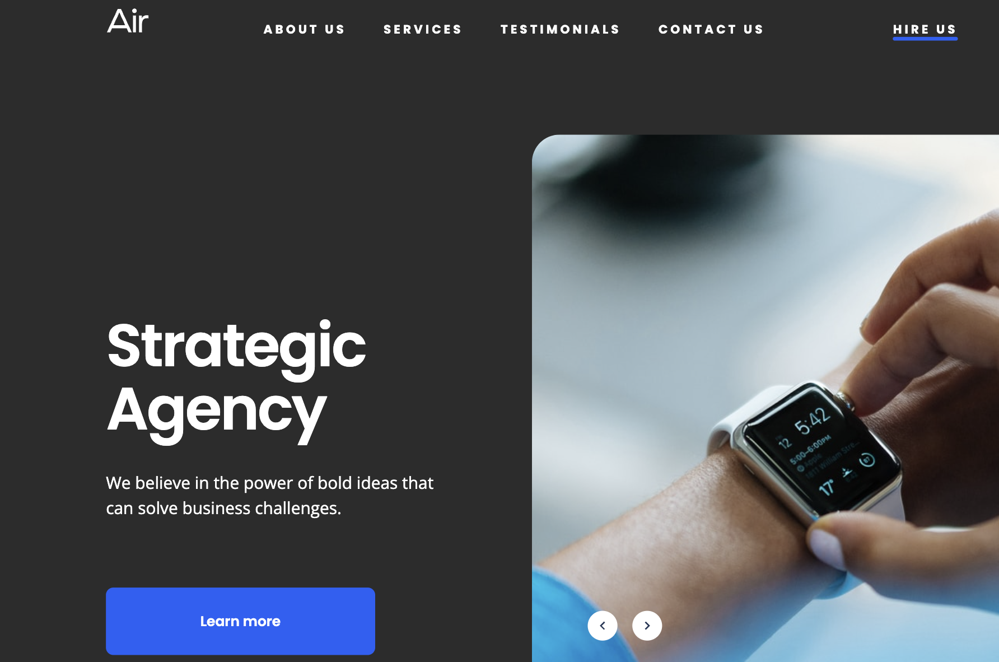
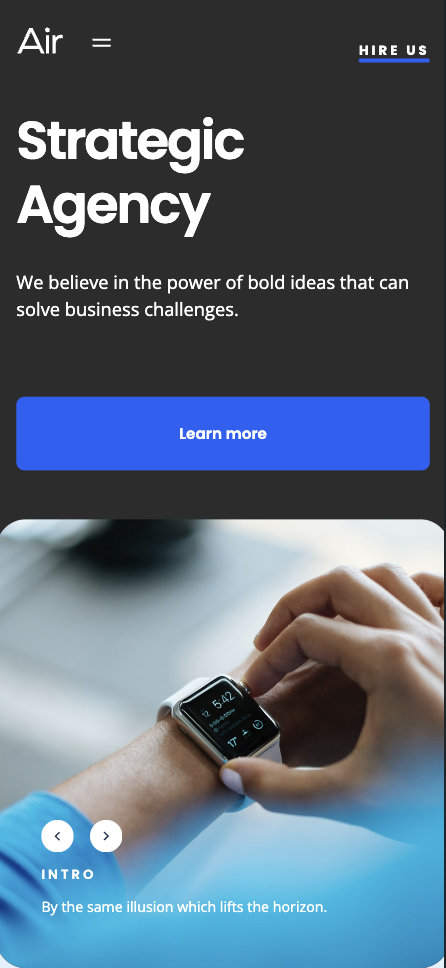

# Air Landing Page

This is a responsive landing page for “Air,” designed with a focus on precision, responsiveness, and functionality.

## Table of contents

- [Overview](#overview)
  - [The challenge](#the-challenge)
  - [Getting started](#getting-started)
  - [Screenshot](#screenshot)
  - [Links](#links)
- [My process](#my-process)
  - [Built with](#built-with)
  - [Features](#features)

## Overview

### The challenge

The landing page was implemented according to the Figma design and includes the following key requirements::

- Responsive Design
- Key Blocks:
  - Header with navigation linking to sections.
	- Strategic Agency” block with an absolutely positioned slider inside a container.
	- Who We Are” and “Our Expertise” sections with reusable cards.
	- Process” block with animated cards.
	- Testimonials” block with fixed-width cards and responsive layouts.
	- Vision, Passion, Results” section with a custom background.
	- Send Us a Message” and “Contact Us” sections with functional forms.
	- Footer with links and social icons.

### Getting Started

Prerequisites

To run this project locally, ensure you have the following installed:
-	Node.js: Version 14.x
- npm: Comes with Node.js (used for installing dependencies)
- Git: For cloning the repository

Installation
- 1. Clone the Repository
      git clone https://github.com/NKoshmak/air-landing-page.git
- 2. Navigate to the Project Directory
      cd air-landing-page
- 3. Install Dependencies
      npm install
- 4. Run the Project Locally
      npm start
- 5. Open your browser and navigate to http://localhost:3000.

### Screenshots

#### Screenshot

### Links

- [Solution URL](https://github.com/NKoshmak/air-landing)
- [Live Site URL](https://nkoshmak.github.io/air-landing/)

## My process

### Built with

- Semantic HTML5
- CSS/SASS
- Flexbox & Grid, Transitions
- BEM Methodology
- JavaScript

### Features
- Pixel-perfect implementation of the Figma design.
- Dynamic and smooth animations with consistent speed.
- Fully responsive layout with no horizontal scrolling on mobile.
- Interactive sliders, buttons, and cards with hover effects.
- Form validation to prevent submission of empty fields.
- Links for navigation and contact information.
- Smooth scrolling to section anchors for a seamless user experience.
- Clear placeholders in form fields and intuitive formatting for inputs.
